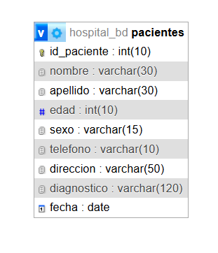

# 🏥 BD_Hospital_Samy
## 📝 Datos de Identificación
* **Institución:** Universidad Politécnica de Atlautla (UPA)
* **Carrera:** Ingeniería en Tecnologías de la Información
* **Asignatura:** Base de Datos 
* **Actividad:** Actividad 4.4 Operaciones en Bases de Datos 
* **Alumno:** Josue Urbina Huerta
* **Grupo:** 131
---
## 📘 Descripción del Proyecto
Este proyecto consiste en una aplicación web funcional desarrollada en **PHP** y conectada a una base de datos relacional en **MySQL/MariaDB** (configurada en el puerto `3307`). El sistema implementa un ciclo completo de operaciones **CRUD** (Create, Read, Update, Delete) para la gestión y administración eficiente del registro de pacientes de una clínica o sanatorio.
---
## 🗄️ Estructura de la Tabla de Datos (`pacientes`)
La información se almacena de manera persistente en la tabla `pacientes`, la cual cuenta con los siguientes campos y tipos de datos validados para su correcto funcionamiento:

A## 🗺️ Modelo Relacional de la Base de Datos

| Campo | Tipo de Datos | Descripción |
| :--- | :--- | :--- |
| **id_paciente** | INT (Auto_Increment) | Llave primaria única que identifica a cada paciente. |
| **nombre** | VARCHAR(50) | Nombre(s) del paciente registrado. |
| **apellido** | VARCHAR(50) | Apellido(s) del paciente. |
| **edad** | INT | Edad del paciente. |
| **sexo** | VARCHAR(15) | Género del paciente (Masculino / Femenino / Otro). |
| **telefono** | VARCHAR(15) | Número telefónico de contacto. |
| **direccion** | TEXT / VARCHAR(100) | Domicilio actual del paciente. |
| **diagnostico** | TEXT / VARCHAR(255) | Padecimiento o motivo médico de la consulta. |
| **fecha_ingresso** | DATE | Fecha formal de ingreso al centro médico. |

---
## 🛠️ Arquitectura y Flujo del Sistema
El sistema se encuentra modularizado en los siguientes archivos incluidos en este repositorio:
1. **`conexion.php`:** Gestiona el enlace directo con el servidor local mediante `mysqli_connect` apuntando al puerto `3307`.
2. **`formulario.php`:** Interfaz gráfica orientada al usuario para la captura limpia de los datos de salud.
3. **`guardar.php`:** Procesa la inserción remota de los datos mediante una sentencia SQL `INSERT INTO`.
4. **`mostrar.php`:** Panel de control principal que extrae las filas de la base de datos con comandos `SELECT` y las pinta en una tabla estética, añadiendo opciones dinámicas de control.
5. **`editar.php`:** Permite la modificación y reescritura de los datos existentes mediante sentencias `UPDATE` basadas en el ID.
6. **`eliminar.php`:** Remueve registros obsoletos o de prueba empleando instrucciones estructuradas `DELETE FROM`.
7. **`hospital_db.sql`:** Script de respaldo que contiene la estructura e inicialización de la base de datos para su fácil migración o evaluación.
